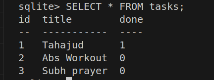

# Task API

A simple CRUD REST API for managing tasks, built with Node.js and Express as part of the Week 2 backend exercises.

## Features

- Full CRUD (Create, Read, Update, Delete) for tasks
- In-memory data store (resets on server restart)
- Input validation with proper HTTP status codes
- Interactive API documentation via Swagger UI

## Requirements

- Node.js and npm installed

## Installation

```bash
git clone https://github.com/aarogund/CRUD-API.git
cd CRUD-API
npm install
```

## Running the server

```bash
node CRUD-API.js
```

The server starts on `http://localhost:3000`.

## API Documentation

Interactive Swagger UI docs are available at:

```
http://localhost:3000/docs
```

## Endpoints

| Method | Path            | Description                     |
|--------|-----------------|----------------------------------|
| GET    | `/`             | API information                 |
| GET    | `/health`       | Health check                    |
| GET    | `/tasks`        | List all tasks                  |
| POST   | `/tasks`        | Create a new task                |
| GET    | `/tasks/{id}`   | Get a single task by id         |
| PUT    | `/tasks/{id}`   | Update a task by id             |
| DELETE | `/tasks/{id}`   | Delete a task by id             |

### Task object shape

```json
{
  "id": 1,
  "title": "Buy milk",
  "done": false
}
```

## Example requests

**Create a task:**
```bash
curl -X POST http://localhost:3000/tasks \
  -H "Content-Type: application/json" \
  -d '{"title":"Buy milk"}'
```

**Update a task:**
```bash
curl -X PUT http://localhost:3000/tasks/1 \
  -H "Content-Type: application/json" \
  -d '{"done":true}'
```

**Delete a task:**
```bash
curl -X DELETE http://localhost:3000/tasks/1
```
## Database
 
### Why SQLite
 
SQLite was chosen because it requires no separate database server to install, configure, or run — the entire database lives in a single file (`tasks.db`) that the app reads and writes directly. For a small task-management API like this, that means:
 
- Zero setup for anyone cloning the repo — just `npm install` and the database is created automatically on first run.
- No connection strings, ports, or credentials to manage.
- Fast enough for this project's scale (a single-user task list), while still giving real SQL — proper schema constraints, transactions, and queryability — instead of a flat file or in-memory array.
### Where the database file is stored
 
The database lives at the project root as `tasks.db`, created automatically the first time the server starts (via `CREATE TABLE IF NOT EXISTS` in `CRUD-API.js`). It is **not committed to git** — it's listed in `.gitignore` since it's local runtime data, regenerated fresh (with seed data) on first run in any environment.
 
### How to start the project
 
```bash
git clone https://github.com/aarogund/CRUD-API.git
cd CRUD-API
npm install
node CRUD-API.js
```
 
The server starts on `http://localhost:3000`. On first run, `tasks.db` is created and seeded with three example tasks; on subsequent runs, existing data is preserved. Interactive API docs are available at `http://localhost:3000/docs`.
 
### Database viewer

### Example query
 
Filtering tasks by completion status and a title search, as used in the `GET /tasks` endpoint:
 
```sql
SELECT * FROM tasks
WHERE 1=1
  AND done = 1
  AND LOWER(title) LIKE '%workout%';
```
 
This returns all completed tasks whose title contains "workout" (case-insensitive).
